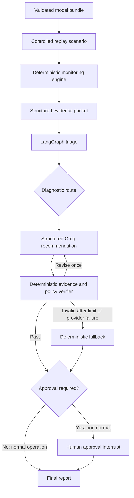

# Agentic Model Risk & Monitoring Copilot

This project registers two validated classifiers—credit default and BRFSS
diabetes-risk screening—and replays each through six controlled monitoring scenarios.
Deterministic Python components calculate data-quality, drift, and
label-availability/performance evidence, while one LangGraph orchestrator routes the
investigation and Groq GPT-OSS produces strict structured recommendations. A deterministic verifier
checks every cited evidence ID and policy constraint, permits one bounded revision, and
routes non-normal recommendations through human approval. The result is a reviewable
replay-based monitoring workflow—not an autonomous remediation or production deployment.

## Key capabilities

- Strict YAML model registry with explicit manifests and no filename-guessing runtime
- Reusable binary-classification adapter for inference, thresholds, validation, and metrics
- Credit-risk and diabetes-screening policy packs with domain-specific terminology
- Self-contained credit bundle (36 predictors, 6,002 held-out rows) and diabetes bundle
  (21 raw predictors, 52 transformed features, 50,736 held-out rows)
- Data-quality, feature-drift, prediction-drift, and labelled-performance monitoring
- Stable evidence IDs, deterministic incident candidates, and deterministic severity
- One LangGraph orchestrator with conditional diagnostic routing
- Strict Groq `json_schema` triage and recommendation outputs
- Deterministic evidence and policy verification
- One bounded LLM revision followed by a deterministic fallback if still invalid
- LangGraph human-approval interrupt for every non-normal recommendation
- Optional local SQLite checkpointing for cross-process approval resume
- Safe abstention when outcomes are absent or below the labelled-sample minimum
- JSON and Markdown monitoring and agentic reports
- Separate fake and live execution provenance
- Deterministic evaluation without an LLM-as-judge

## Registered models

| Model ID | Domain | Bundle mode | Reference | Operating threshold |
|---|---|---|---:|---:|
| `credit_default` | Credit risk | `live_inference` | 6,002 rows / 36 features | 0.25 |
| `diabetes_risk` | Survey-based diabetes-risk screening | `live_inference` | 50,736 rows / 21 raw features | 0.25 |

The diabetes model reproduces the authoritative held-out ROC-AUC `0.828593`, PR-AUC
`0.429353`, recall `0.589900`, precision `0.386469`, F1 `0.466991`, and Brier score
`0.096986` at the source operating threshold. It is a survey-based research screening
model, not a diagnostic or treatment system.

## Architecture



Data-quality, drift, and performance functions are deterministic analytical components,
not separate agents. The LLM synthesizes evidence into a controlled recommendation; it
does not calculate monitoring metrics or execute remediation.

## Controlled scenarios

| Scenario | Controlled change | Intended monitoring behavior |
|---|---|---|
| Normal operation | Unchanged stratified reference replay | Stable evidence and no approval |
| Feature drift | Domain-specific controlled covariate shifts | Drift/prediction/performance investigation |
| Data-quality failure | Duplicate IDs, missing values, and range violations | Block inference and quarantine/investigate |
| Synthetic performance degradation | Flip 180 low-risk negative labels to positive | Detect labelled performance degradation |
| Unlabelled drift | Domain-specific valid covariate shifts with no labels | Investigate drift without a performance claim |
| Insufficient labels | Stable 1,000-row batch with only 100 aligned labels | Abstain and collect labels before performance evaluation |

The performance-degradation case deliberately modifies labels to simulate
outcome/concept drift. It is not an observed real-world incident.

## Live Groq evaluations

Both model evaluations used Groq `openai/gpt-oss-20b`, temperature `0`, strict
`json_schema`, and at most one LLM revision. Fake-provider outputs are separate and are
not counted as live results.

### Diabetes-risk live result

| Scenario | Live incident | Route | Revisions | Fallback | Final status |
|---|---|---|---:|---:|---|
| Normal operation | `normal_operation` | `no_additional_diagnostics` | 0 | No | `completed_no_approval_required` |
| Feature drift | `mixed_incident` | `mixed_diagnostics` | 0 | Yes | `approved` |
| Data-quality failure | `data_quality_failure` | `data_quality_diagnostics` | 0 | No | `approved` |
| Performance degradation | `performance_degradation` | `performance_diagnostics` | 0 | No | `approved` |
| Unlabelled drift | `feature_drift` | `drift_diagnostics` | 0 | Yes | `approved` |
| Insufficient labels | `insufficient_evidence` | `evidence_sufficiency_review` | 0 | No | `approved` |

Measured over the six diabetes replays:

- `66.67%` structured-output success and `66.67%` first-pass verification
- `100%` incident compatibility, route compatibility, evidence grounding, policy
  compliance, and approval completion
- `33.33%` fallback; two recommendation calls were rate-limited, and the unlabelled case
  also had an incompatible live triage caught by deterministic verification
- mean/median LLM latency `14,532.31 / 10,074.59 ms`
- `25,496` input, `6,999` output, and `32,495` recorded tokens

The factual diabetes verdict is `live_agent_requires_revision`. Both fallback cases remain
preserved byte-for-byte as the authoritative first-run results; a later isolated repeat
check did not replace or prompt-tune them.

### Cross-model result

The preserved credit evaluation and new diabetes evaluation cover 12 controlled live
replays: `83.33%` structured output, `100%` incident/routing/grounding/policy/approval,
`75%` first-pass verification, `8.33%` revision, and `16.66%` fallback. Domain-specific predictive metrics
are not averaged.

The original four-scenario evaluation remains preserved under
`reports/evaluations/live_groq/`. See the
[diabetes live evaluation report](reports/evaluations/diabetes_risk/live_groq_six_scenarios/live_evaluation_report.md),
[cross-model report](reports/evaluations/cross_model/cross_model_report.md),
[claim audit](docs/claim_audit.md), and
[final project report](reports/final_project_report.md).

### Repeat reliability check

Only the two first-run diabetes fallback cases were repeated, using the same bundle,
scenario inputs, prompts, evidence, schemas, and policies. Feature drift completed
first-pass with no HTTP 429, no revision, and no fallback. Unlabelled drift did not repeat
either its incompatible initial triage or recommendation HTTP 429, but a different
recommendation-verification issue used the single allowed revision before passing; it did
not fall back.

Across these two supplementary repeats, structured output, incident/route compatibility,
grounding, policy compliance, and approval completion were `100%`; first-pass
verification was `50%` and fallback was `0%`. These are two-case observations, not a
reliability estimate. A successful repeat does not erase an original provider failure,
and the original 12-case metrics remain the headline evaluation and CV metrics. The
deterministic fallback remains an intended safety control. See the
[repeat reliability report](reports/evaluations/diabetes_risk/reliability_rerun/reliability_report.md).

## Quick start

Windows PowerShell setup:

```powershell
py -3.13 -m venv .venv
.\.venv\Scripts\Activate.ps1
python -m pip install -e ".[dev]"
```

Create an untracked `.env` from the documented variable names:

```env
LLM_PROVIDER=groq
LLM_MODEL=openai/gpt-oss-20b
LLM_TEMPERATURE=0
LLM_TIMEOUT_SECONDS=30
LLM_MAX_RETRIES=1
LLM_MAX_REVISION_ATTEMPTS=1
GROQ_API_KEY=
LANGGRAPH_STRICT_MSGPACK=true
AGENT_CHECKPOINT_BACKEND=memory
AGENT_CHECKPOINT_DB=artifacts/checkpoints/agent_checkpoints.sqlite
```

### Existing-artifacts demo

List both registered models and use checked local artifacts without rebuilding:

```powershell
python scripts\list_registered_models.py
python scripts\run_agentic_monitoring.py `
  --model-id diabetes_risk `
  --scenario performance_degradation `
  --decision approve `
  --reviewer "demo-reviewer"
python scripts\evaluate_live_agent.py --model-id diabetes_risk
python scripts\evaluate_cross_model_agent.py
```

### Diabetes onboarding and reconstruction

The source project is inspected read-only and the existing fitted pipeline/calibrator are
exported without retraining:

```powershell
python scripts\inspect_model_project.py `
  --source-project "<path-to-25BM6JP22>" `
  --output reports\onboarding\diabetes_risk
python scripts\onboard_binary_classifier.py `
  --source-project "<path-to-25BM6JP22>" `
  --manifest configs\models\diabetes_risk.yaml `
  --model-id diabetes_risk
python scripts\generate_monitoring_scenarios.py --all --model-id diabetes_risk
python scripts\run_monitoring.py --all --model-id diabetes_risk
python scripts\run_agentic_monitoring.py `
  --model-id diabetes_risk `
  --scenario performance_degradation `
  --decision approve `
  --reviewer "demo-reviewer"
python scripts\evaluate_live_agent.py --model-id diabetes_risk
```

See [model onboarding](docs/model_onboarding.md), the
[binary-classification adapter](docs/binary_classification_adapter.md), and the
[reproducibility guide](docs/reproducibility.md).

## Report provenance

```text
reports/generated/<model_id>/<scenario>/
├── monitoring_result.json
├── monitoring_report.md
├── fake/
│   ├── agentic_result.json
│   └── agentic_report.md
└── live_groq/
    ├── agentic_result.json
    └── agentic_report.md
```

Every agentic report records provider, model, execution mode, fake/live flag, run ID,
thread ID, and UTC creation time. Parsed structured outputs and safe usage metadata are
retained; API keys and raw provider reasoning are not.

SQLite-resumed demonstrations write separately under
`reports/generated/<scenario>/live_groq_persistent/<thread-id>/` and record backend,
relative database path, pause/resume counts, and cross-process resume provenance.

## Portfolio documentation

- [Final project report](reports/final_project_report.md)
- [Claim audit](docs/claim_audit.md)
- [Interview defense](docs/interview_defense.md)
- [Demo guide](docs/demo_guide.md)
- [CV and portfolio wording](docs/cv_bullets.md)
- [Architecture decision record](docs/adr/001-single-orchestrator-agent.md)
- [Adapter-based onboarding decision](docs/adr/002-adapter-based-model-onboarding.md)
- [Model onboarding guide](docs/model_onboarding.md)
- [Reproducibility guide](docs/reproducibility.md)
- [Limitations](docs/limitations.md)

## Repository structure

```text
artifacts/                  Validated model, metadata, and baselines
configs/                    Registry, manifests, thresholds, and scenario definitions
data/                       Reference and replay scenario data
docs/                       Architecture, methodology, audit, demo, and portfolio guides
registered_models/          Self-contained bundles added through onboarding
reports/generated/          Deterministic and fake/live agentic reports
reports/evaluations/        Deterministic live-agent evaluation
scripts/                    Export, validation, monitoring, agent, and evaluation CLIs
src/monitoring_agent/       Bundle, monitoring, scenario, agent, and evaluation packages
tests/                      Focused bundle, monitoring, agent, and evaluation tests
```

## Focused validation

The final focused bundle/monitoring/scenario/evaluation/agent/model/adapter/onboarding
target covers 87 tests. The only warnings were the documented
joblib/NumPy deserialization deprecations. Targeted Ruff passed for the requested source,
CLI, and test scope. No full-repository test or lint claim is made.

## Limitations

- Six controlled replay scenarios rather than production traffic
- Two public academic datasets and internal held-out reference splits
- Synthetic feature, data-quality, and outcome transformations
- Provisional monitoring thresholds requiring business governance
- Memory by default, with optional local SQLite checkpointing that is not production-grade
- One Groq model and only 12 cross-model controlled live replays
- No durable incident database, real-time ingestion, or production deployment
- No automated remediation, retraining, rollback, or decision execution
- No production-readiness claim

See [limitations.md](docs/limitations.md) for the complete assessment.

## Future work

- Production-grade checkpointing and governed incident persistence
- A broader, repeated incident benchmark
- Threshold governance against operating costs
- Additional governed adapters only when a genuinely new prediction contract requires one
- Specialist subgraphs only when distinct evidence and tools justify them
- Production-grade deployment and observability after governance validation
