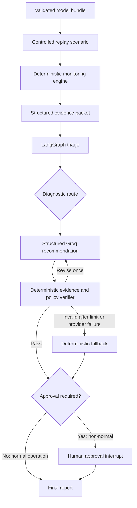

# Agentic Model Risk & Monitoring Copilot

This project replays a validated credit-default model bundle through six controlled
monitoring scenarios. Deterministic Python components calculate data-quality, drift, and
label-availability/performance evidence, while one LangGraph orchestrator routes the investigation
and Groq GPT-OSS produces strict structured recommendations. A deterministic verifier
checks every cited evidence ID and policy constraint, permits one bounded revision, and
routes non-normal recommendations through human approval. The result is a reviewable
replay-based monitoring workflow—not an autonomous remediation or production deployment.

## Key capabilities

- Self-contained XGBoost credit-default bundle with 36 predictors and a 6,002-row
  held-out reference set
- Data-quality, feature-drift, prediction-drift, and labelled-performance monitoring
- Stable evidence IDs, deterministic incident candidates, and deterministic severity
- One LangGraph orchestrator with conditional diagnostic routing
- Strict Groq `json_schema` triage and recommendation outputs
- Deterministic evidence and policy verification
- One bounded LLM revision followed by a deterministic fallback if still invalid
- LangGraph human-approval interrupt for every non-normal recommendation
- Optional local SQLite checkpointing for cross-process approval resume
- Safe abstention when outcomes are absent or below the labelled-sample minimum
- JSON and Markdown monitoring and agentic reports
- Separate fake and live execution provenance
- Deterministic evaluation without an LLM-as-judge

## Architecture



Data-quality, drift, and performance functions are deterministic analytical components,
not separate agents. The LLM synthesizes evidence into a controlled recommendation; it
does not calculate monitoring metrics or execute remediation.

## Controlled scenarios

| Scenario | Controlled change | Intended monitoring behavior |
|---|---|---|
| Normal operation | Unchanged stratified reference replay | Stable evidence and no approval |
| Feature drift | Credit-limit and repayment-delay covariate shifts | Drift/prediction/performance investigation |
| Data-quality failure | Duplicate IDs, missing payments, and range violations | Block inference and quarantine/investigate |
| Synthetic performance degradation | Flip 180 low-risk negative labels to positive | Detect labelled performance degradation |
| Unlabelled drift | Valid `LIMIT_BAL`, `PAY_2`, and `MaxPaymentDelay` shifts with no labels | Investigate drift without a performance claim |
| Insufficient labels | Stable 1,000-row batch with only 100 aligned labels | Abstain and collect labels before performance evaluation |

The performance-degradation case deliberately modifies labels to simulate
outcome/concept drift. It is not an observed real-world incident.

## Live Groq evaluation

The final evaluation used Groq `openai/gpt-oss-20b`, temperature `0`, strict
`json_schema`, and at most one LLM revision.

| Scenario | Live incident | Route | Revisions | Fallback | Final status |
|---|---|---|---:|---:|---|
| Normal operation | `normal_operation` | `no_additional_diagnostics` | 0 | No | `completed_no_approval_required` |
| Feature drift | `mixed_incident` | `mixed_diagnostics` | 0 | No | `approved` |
| Data-quality failure | `data_quality_failure` | `data_quality_diagnostics` | 1 | No | `approved` |
| Performance degradation | `performance_degradation` | `performance_diagnostics` | 0 | No | `approved` |
| Unlabelled drift | `feature_drift` | `drift_diagnostics` | 0 | No | `approved` |
| Insufficient labels | `insufficient_evidence` | `evidence_sufficiency_review` | 0 | No | `approved` |

Measured over the six-scenario robustness evaluation:

- `6/6` compatible incident classifications
- `6/6` compatible diagnostic routes
- `100%` evidence grounding and `100%` policy compliance
- `83.33%` first-pass verification and `0%` fallback
- `100%` approval completion

Five scenarios passed verification immediately. The preserved data-quality recommendation violated
a hard rule on its first pass, received concise verifier feedback, and passed after the
single permitted revision. No scenario required fallback; the result demonstrates that
the verifier/revision control operated as designed within this six-case benchmark.

The original four-scenario evaluation remains preserved under
`reports/evaluations/live_groq/`. See the
[six-scenario live evaluation report](reports/evaluations/live_groq_six_scenarios/live_evaluation_report.md),
[claim audit](docs/claim_audit.md), and
[final project report](reports/final_project_report.md).

## Quick start

Windows PowerShell setup:

```powershell
py -3.13 -m venv .venv
.\.venv\Scripts\Activate.ps1
python -m pip install -e ".[dev]"
```

Create an untracked `.env` from the documented variable names:

```env
LLM_PROVIDER=groq
LLM_MODEL=openai/gpt-oss-20b
LLM_TEMPERATURE=0
LLM_TIMEOUT_SECONDS=30
LLM_MAX_RETRIES=1
LLM_MAX_REVISION_ATTEMPTS=1
GROQ_API_KEY=
LANGGRAPH_STRICT_MSGPACK=true
AGENT_CHECKPOINT_BACKEND=memory
AGENT_CHECKPOINT_DB=artifacts/checkpoints/agent_checkpoints.sqlite
```

### Existing-artifacts demo

Use the checked local artifacts without regenerating the bundle or scenarios:

```powershell
python scripts\validate_credit_default_bundle.py
python scripts\run_agentic_monitoring.py `
  --scenario performance_degradation `
  --decision approve `
  --reviewer "demo-reviewer"
python scripts\evaluate_live_agent.py --extended
```

### Full local reconstruction

Run this only when intentionally rebuilding generated replay artifacts:

```powershell
python scripts\validate_credit_default_bundle.py
python scripts\generate_monitoring_scenarios.py --all --overwrite
python scripts\run_monitoring.py --all
python scripts\run_agentic_monitoring.py `
  --scenario performance_degradation `
  --decision approve `
  --reviewer "demo-reviewer"
python scripts\evaluate_live_agent.py --extended
```

Bundle export from the separate source-model repository is documented in
[reproducibility.md](docs/reproducibility.md).

## Report provenance

```text
reports/generated/<scenario>/
├── monitoring_result.json
├── monitoring_report.md
├── fake/
│   ├── agentic_result.json
│   └── agentic_report.md
└── live_groq/
    ├── agentic_result.json
    └── agentic_report.md
```

Every agentic report records provider, model, execution mode, fake/live flag, run ID,
thread ID, and UTC creation time. Parsed structured outputs and safe usage metadata are
retained; API keys and raw provider reasoning are not.

SQLite-resumed demonstrations write separately under
`reports/generated/<scenario>/live_groq_persistent/<thread-id>/` and record backend,
relative database path, pause/resume counts, and cross-process resume provenance.

## Portfolio documentation

- [Final project report](reports/final_project_report.md)
- [Claim audit](docs/claim_audit.md)
- [Interview defense](docs/interview_defense.md)
- [Demo guide](docs/demo_guide.md)
- [CV and portfolio wording](docs/cv_bullets.md)
- [Architecture decision record](docs/adr/001-single-orchestrator-agent.md)
- [Reproducibility guide](docs/reproducibility.md)
- [Limitations](docs/limitations.md)

## Repository structure

```text
artifacts/                  Validated model, metadata, and baselines
configs/                    Monitoring thresholds and scenario definitions
data/                       Reference and replay scenario data
docs/                       Architecture, methodology, audit, demo, and portfolio guides
reports/generated/          Deterministic and fake/live agentic reports
reports/evaluations/        Deterministic live-agent evaluation
scripts/                    Export, validation, monitoring, agent, and evaluation CLIs
src/monitoring_agent/       Bundle, monitoring, scenario, agent, and evaluation packages
tests/                      Focused bundle, monitoring, agent, and evaluation tests
```

## Focused validation

The focused agent/evaluation/scenario/monitoring tests passed after two isolated
test-support failures were fixed and rerun. Targeted Ruff passed for the exact requested
source, CLI, and test scope. No full-repository test or lint claim is made.

## Limitations

- Six controlled replay scenarios rather than production traffic
- Public academic credit-default data and a random held-out reference split
- Synthetic feature, data-quality, and outcome transformations
- Provisional monitoring thresholds requiring business governance
- Memory by default, with optional local SQLite checkpointing that is not production-grade
- One Groq model and a small live benchmark
- No durable incident database, real-time ingestion, or production deployment
- No automated remediation, retraining, rollback, or decision execution
- No production-readiness claim

See [limitations.md](docs/limitations.md) for the complete assessment.

## Future work

- Production-grade checkpointing and governed incident persistence
- A broader, repeated incident benchmark
- Threshold governance against operating costs
- Additional monitored model bundles
- Specialist subgraphs only when distinct evidence and tools justify them
- Production-grade deployment and observability after governance validation
